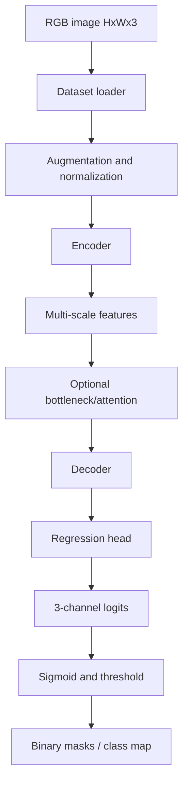
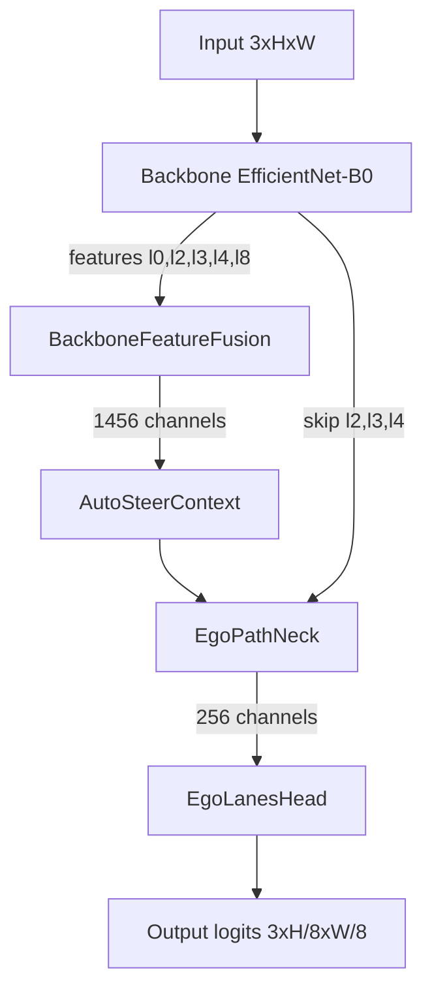
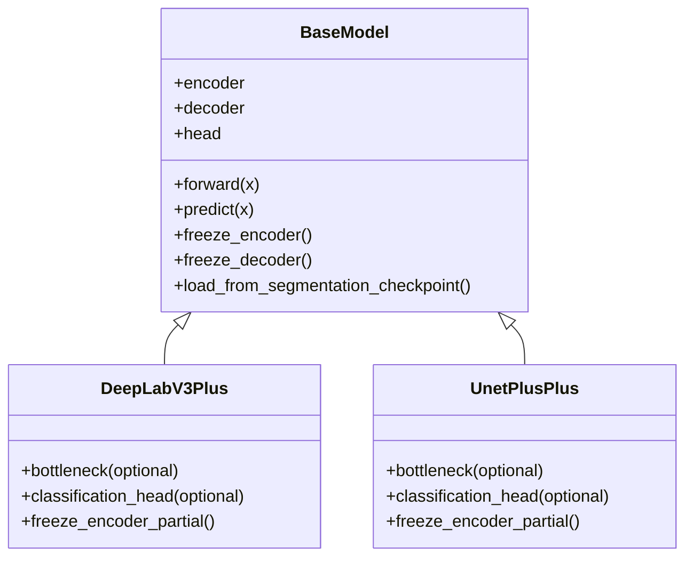
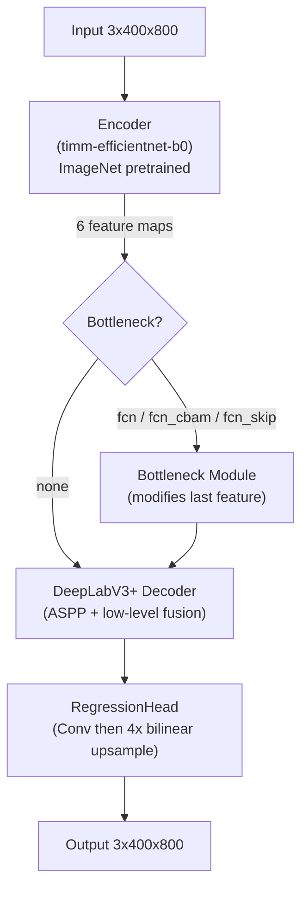
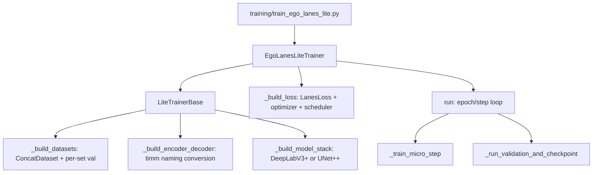
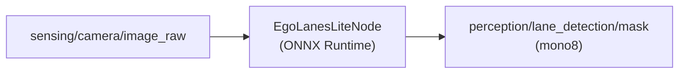

# EgoLanes & EgoLanesLite — Architecture Guide

This document provides a comprehensive overview of the **EgoLanes** model and its active counterpart, **EgoLanesLite**. Designed for robust and real-time ego-lane segmentation, these models process road imagery to identify the ego-left, ego-right, and other lanes. It merges implementation-level details (module internals, shapes, defaults, launch/export specifics) with system/training interpretation (dataset conversion logic, semantic rationale, formalized loss math).

**Why it's called "EgoLanes":**  
"Ego" refers to the **ego vehicle** (the host vehicle carrying the camera), and "Lanes" refers to lane-boundary segmentation. The core task is not generic lane detection; it is specifically to identify the lanes most relevant to the ego vehicle — especially the **ego-left** and **ego-right** boundaries used for control and path planning.

---

## 1. System Scope and Output Contract

The system takes a single RGB road image (typically from a front-facing vehicle camera) as input and produces a 3-channel lane mask.

- **Input**: front camera RGB image, shape `H × W × 3`
- **Model output**: 3-channel logits (later thresholded to masks/classes), shape `H × W × 3` (or lower resolution before head upsampling)

Channel semantics:

| Channel | Meaning                     | Common color convention |
| ------- | --------------------------- | ----------------------- |
| 0       | **Ego-left lane boundary**  | Cyan / Red              |
| 1       | **Ego-right lane boundary** | Magenta / Green         |
| 2       | **Other lanes**             | Green / Blue            |

> [!IMPORTANT]
> By distinctly predicting the left and right ego-lanes as separate channels, the downstream autonomous stack (e.g., Autoware ROS 2 nodes) can directly compute the **lane center** and **lateral offset** for auto-steering without running complex clustering algorithms.

---

## 2. Architecture Families in This Repo

1. **EgoLanesNetwork (Legacy)** — custom encoder-fusion-context-neck-head pipeline built from scratch. Retained for backward compatibility and legacy inference.

2. **EgoLanesLite (Active)** — production architecture using industry-standard backbones (EfficientNet-B0 via [timm](https://github.com/huggingface/pytorch-image-models)) with either **DeepLabV3+** or **UNet++** decoders from [Segmentation Models PyTorch (SMP)](https://github.com/qubvel-org/segmentation_models.pytorch), a custom regression head, and optional bottleneck/attention modules. Highly suitable for TensorRT/ONNX deployment in ROS 2.

---

## 3. End-to-End Prediction Pipeline (Unified View)



For ROS2 deployment, class map convention is:

- `0`: background
- `1`: ego-left
- `2`: ego-right
- `3`: other

---

## 4. Data Pipeline

### 4.1 Expected Dataset Structure

```text
CarlaEgoLanes/processed/
├── image/    (*.jpg, *.png)
└── mask/     (*.png, 3-channel binary mask)
```

The training stack supports lane datasets such as **Carla**, **CurveLanes**, **TUSimple**, and also includes broader segmentation dataset support (Cityscapes, BDD100K, ACDC, Mapillary, IDDA) through shared infrastructure.

### 4.2 Mask Format and Conversion

Training expects paired RGB + 3-channel binary lane masks (`0/255` storage; normalized to `[0,1]` in dataloader).

If source data is single-channel merged lanes, conversion utilities are used:

- **`bottom_up`**: traces lanes from lower image region upward to separate ego-left/ego-right/other.
- **`component_scan`**: connected-component analysis + center proximity heuristics.

### 4.3 Dataloaders

Typical loader classes include:

- `CarlaDataset`
- `TUSimpleDataset`
- `CurveLanesDataset`

Common per-sample flow (`__getitem__`):

1. Read image and mask.
2. Apply augmentations.
3. Convert image to `CHW float32`.
4. Normalize mask from `[0,255]` to `[0,1]`.

### 4.4 Augmentation Pipeline

File: [data_utils/lite_models/augmentation/lanes.py](data_utils/lite_models/augmentation/lanes.py)

Built on [Albumentations](https://albumentations.ai/):

| Stage     | Training                                                        | Validation        |
| --------- | --------------------------------------------------------------- | ----------------- |
| Resize    | Fixed `800×400` or RandomCrop path                              | Fixed `800×400`   |
| Flip      | HorizontalFlip (`p=0.5`) + **left↔right channel swap**          | None              |
| Noise     | Configurable profiles (`none`/`moderate`/`heavy`)               | None              |
| Color     | Jitter/intensity perturbation (brightness, contrast, ISO noise) | None/minimal      |
| Normalize | ImageNet mean/std                                               | ImageNet mean/std |

> [!IMPORTANT]
> **Semantic-aware horizontal flips**: When a horizontal flip is applied, the left and right lane semantics are mirrored. Therefore, the pipeline specifically **swaps Channel 0 (ego-left) and Channel 1 (ego-right)** within the mask to ensure the semantic meaning remains physically accurate. A flipped left lane becomes the right lane.

---

## 5. Legacy Architecture: EgoLanesNetwork

> [!NOTE]
> This stack is retained for backward compatibility and legacy inference. New training uses EgoLanesLite exclusively.

### 5.1 Legacy Pipeline



### 5.2 Legacy Modules (Concrete)

#### 5.2.1 Backbone

File: [model_components/backbone.py](model_components/backbone.py)

- Uses `torchvision.models.efficientnet_b0` pretrained on ImageNet, balancing parameter efficiency and feature richness.
- Runs all 9 sequential blocks (`encoder[0]` through `encoder[8]`) and returns **5 selected feature maps** at different resolutions:

```python
return [l0, l2, l3, l4, l8]  # channels: [32, 24, 40, 80, 1280]
```

**Reference**: Tan & Le, _"EfficientNet: Rethinking Model Scaling for CNNs"_, ICML 2019. ([arXiv:1905.11946](https://arxiv.org/abs/1905.11946))

#### 5.2.2 BackboneFeatureFusion

File: [model_components/backbone_feature_fusion.py](model_components/backbone_feature_fusion.py)

Downsamples each feature map to the **same spatial resolution** using repeated `MaxPool2d(2,2)`, then **concatenates** along the channel dimension. This aggregates features from different spatial resolutions to retain both low-level spatial details (crucial for thin lanes) and high-level semantic information.

| Feature   | Pool count | Channels |
| --------- | ---------- | -------- |
| l0        | 4×         | 32       |
| l2        | 3×         | 24       |
| l3        | 2×         | 40       |
| l4        | 1×         | 80       |
| l8        | 0×         | 1280     |
| **Total** | —          | **1456** |

This is a form of **Hypercolumn** feature aggregation.

**Reference**: Hariharan et al., _"Hypercolumns for Object Localization and Fine-grained Localization"_, CVPR 2015. ([arXiv:1411.5752](https://arxiv.org/abs/1411.5752))

#### 5.2.3 AutoSteerContext

File: [model_components/auto_steer_context.py](model_components/auto_steer_context.py)

A **global context module** inspired by Squeeze-and-Excitation and self-attention. It implements an attention-like mechanism using MLPs and convolutions to provide global priors about the vehicle's driving path and road curvature:

1. **Global Average Pooling** → `1456`-dim vector
2. **MLP** `1456 → 800 → 800 → 200` (GeLU + Dropout(0.25))
3. **Reshape** to `1 × 1 × 10 × 20` spatial map
4. **Conv expansion** `1 → 128 → 256 → 512 → 1456` back to feature-map shape
5. **Multiplicative attention**: `context = context * features + features`

This learns a scene-level "driving context" that modulates the fused features — conceptually similar to how steering-related cues (road curvature, vanishing point) should globally influence lane prediction.

**References**:

- Hu et al., _"Squeeze-and-Excitation Networks"_, CVPR 2018 ([arXiv:1709.01507](https://arxiv.org/abs/1709.01507))
- Wang et al., _"Non-local Neural Networks"_, CVPR 2018 ([arXiv:1711.07971](https://arxiv.org/abs/1711.07971))

#### 5.2.4 EgoPathNeck

File: [model_components/ego_path_neck.py](model_components/ego_path_neck.py)

A **U-Net-style decoder** acting as the decoder's entry point, fusing the output of the AutoSteerContext with the raw backbone features. Uses transpose-convolutions for spatial upsampling and skip-connections to recover high-resolution spatial boundaries. 3 upsample blocks, each:

1. `ConvTranspose2d` (2× upsample)
2. **Skip connection** via `1×1 Conv` to match channels, then element-wise addition
3. Two `3×3 Conv + GeLU` layers

Channel progression: `1456 → 768 → 512 → 256`
Skip connections from encoder features: `l4(80ch) → l3(40ch) → l2(24ch)`

**Reference**: Ronneberger et al., _"U-Net: Convolutional Networks for Biomedical Image Segmentation"_, MICCAI 2015 ([arXiv:1505.04597](https://arxiv.org/abs/1505.04597))

#### 5.2.5 EgoLanesHead

File: [model_components/ego_lanes_head.py](model_components/ego_lanes_head.py)

The final prediction layer mapping decoded features to the 3-channel logits format:

- `256 → 256 → 128 → 3` (3-layer conv stack)
- GeLU activations in hidden layers
- Outputs unnormalized logits (no sigmoid) — processed via sigmoid/thresholding during inference

---

## 6. Active Architecture: EgoLanesLite

### 6.1 Design Rationale

**EgoLanesLite** was developed to streamline the training process, improve inference speed, and integrate seamlessly with `segmentation_models_pytorch` (SMP). It replaces the hand-crafted pipeline with **proven encoder-decoder architectures**, gaining:

- **Flexible backbone swapping** — any timm encoder can be used, not just EfficientNet-B0
- **Battle-tested decoder implementations** — leveraging years of community validation
- **Training stability** — well-understood gradient flow through standard architectures
- **Transfer-learning control** — partial/full encoder freezing and checkpoint transfer
- **Easy ONNX export** for TensorRT deployment and ROS 2 integration

### 6.2 Class Hierarchy



### 6.3 DeepLabV3+ Variant (Default)

File: [model_components/lite_models/DeepLabv3Plus.py](model_components/lite_models/DeepLabv3Plus.py)



Key parameters (from [configs/EgoLanesLite_train.yaml](configs/EgoLanesLite_train.yaml)):

| Parameter          | Value                  | Meaning                    |
| ------------------ | ---------------------- | -------------------------- |
| `encoder_name`     | `timm-efficientnet-b0` | backbone                   |
| `encoder_depth`    | 5                      | full feature pyramid depth |
| `output_stride`    | 16                     | encoder output ratio       |
| `aspp_dilations`   | `[12, 24, 36]`         | ASPP receptive fields      |
| `decoder_channels` | 64                     | decoder hidden channels    |
| `head_upsampling`  | 4                      | final bilinear upsampling  |
| `output_channels`  | 3                      | lane channels              |

**ASPP (Atrous Spatial Pyramid Pooling)** applies parallel dilated convolutions at rates [12, 24, 36] to capture multi-scale context without losing resolution — critical for detecting lanes at varying distances. Its multi-scale receptive fields effectively capture the vanishing points of lanes in the distance.

**Reference**: Chen et al., _"Encoder-Decoder with Atrous Separable Convolution for Semantic Image Segmentation"_ (DeepLabV3+), ECCV 2018 ([arXiv:1802.02611](https://arxiv.org/abs/1802.02611))

### 6.4 UNet++ Variant (Alternative)

File: [model_components/lite_models/UnetPlusPlus.py](model_components/lite_models/UnetPlusPlus.py)

- Features a **nested, dense skip-connection** layout to bridge the semantic gap between encoder and decoder feature maps.
- Its nested dense skip pathways are particularly adept at segmenting fine-grained structures like **thin lane markings**, ensuring highly accurate localization.
- Activated through config (`network.model: "unetplusplus"`).

**Reference**: Zhou et al., _"UNet++: A Nested U-Net Architecture for Medical Image Segmentation"_, DLMIA 2018 ([arXiv:1807.10165](https://arxiv.org/abs/1807.10165))

### 6.5 Shared Lite Components

#### 6.5.1 RegressionHead

File: [model_components/lite_models/heads.py](model_components/lite_models/heads.py)

Replaces the standard SMP classification head with a custom `RegressionHead` that projects deep decoder features directly to the `H × W × 3` lane mask:

- Configurable `depth` of `3×3 Conv` stack with optional activation between internal layers
- Final layer outputs raw logits (no activation)
- Optional bilinear upsampling (default `4×`) — in DeepLabV3+, this handles the 4× upsampling required to return features from `stride=4` back to the original input resolution

#### 6.5.2 Bottleneck Module

File: [model_components/lite_models/modules.py](model_components/lite_models/modules.py)

Optional module inserted between encoder and decoder, applied only to the last feature map. Supported modes:

| Mode            | Description                                        |
| --------------- | -------------------------------------------------- |
| `fcn`           | Two `3×3` convolutions with ReLU                   |
| `fcn_cbam`      | FCN + CBAM attention (Channel + Spatial attention) |
| `fcn_skip`      | FCN + residual skip connection                     |
| `fcn_skip_cbam` | All combined: FCN + CBAM + residual skip           |

**CBAM** applies both spatial and channel-wise attention sequentially, enabling the network to focus on the long, thin structural priors typical of lane markings while suppressing background noise. It forces the network to concentrate on the lane geometries.

**Reference**: Woo et al., _"CBAM: Convolutional Block Attention Module"_, ECCV 2018 ([arXiv:1807.06521](https://arxiv.org/abs/1807.06521))

#### 6.5.3 Initialization

File: [model_components/lite_models/initialization.py](model_components/lite_models/initialization.py)

- **Decoder**: Kaiming uniform (`fan_in`, ReLU assumption)
- **Head**: Xavier uniform
- **Encoder**: ImageNet pretrained if enabled (otherwise Kaiming init)

---

## 7. Training Objective: LanesLoss

File: [data_utils/lite_models/helpers/loss.py](data_utils/lite_models/helpers/loss.py) — class `LanesLoss`

Lanes are fundamentally thin, high-frequency structures. The loss function is designed to enforce both pixel-level accuracy and structural sharpness.

The per-channel loss is a weighted sum of two terms:

```math
\mathcal{L}_{\text{channel}} = \mathcal{L}_{\text{BCE}} + \lambda_{\text{edge}} \cdot \mathcal{L}_{\text{Edge}}
```

where $\lambda_{\text{edge}}$ is the edge loss weight (default `1.0`).

---

### 7.0.1 Binary Cross-Entropy Loss ( $\mathcal{L}_{\text{BCE}}$ )

Pixel-wise classification over the raw logits:

```math
\mathcal{L}_{\text{BCE}}(P,\, G) = -\frac{1}{N} \sum_{i=1}^{N} \left[ G_i \cdot \log\!\bigl(\sigma(P_i)\bigr) + (1 - G_i) \cdot \log\!\bigl(1 - \sigma(P_i)\bigr) \right]
```

**Where:**

| Symbol          | Description                                                                        |
| --------------- | ---------------------------------------------------------------------------------- |
| $P$             | Predicted logit map (raw model output, before sigmoid), shape $H \times W$         |
| $G$             | Ground-truth binary mask for the channel, values in $\{0, 1\}$, shape $H \times W$ |
| $P_i$           | Predicted logit at pixel $i$                                                       |
| $G_i$           | Ground-truth label at pixel $i$ ($1$ = lane, $0$ = background)                     |
| $\sigma(\cdot)$ | Sigmoid function: $\sigma(x) = \frac{1}{1 + e^{-x}}$                               |
| $N$             | Total number of pixels in the map ($H \times W$)                                   |
| $i$             | Pixel index, ranging from $1$ to $N$                                               |

---

### 7.0.2 Multi-Scale Edge / Boundary Loss ( $\mathcal{L}_{\text{Edge}}$ )

To ensure sharp boundaries for thin lane structures, Sobel filters extract horizontal and vertical gradients from both predictions and ground truth. Inspired by depth estimation tasks (MegaDepth), the absolute difference is averaged across 5 progressively downsampled resolutions (using `AvgPool2d`):

**Single-scale Sobel loss:**

```math
\mathcal{L}_{\text{Sobel}}(P,\, G) = \frac{1}{N} \sum_{i=1}^{N} \left( \left| (S_x \ast P)_i - (S_x \ast G)_i \right| + \left| (S_y \ast P)_i - (S_y \ast G)_i \right| \right)
```

**Multi-scale aggregation:**

```math
\mathcal{L}_{\text{Edge}}(P,\, G) = \frac{1}{5} \sum_{s=0}^{4} \mathcal{L}_{\text{Sobel}}\!\left(\text{AvgPool}^{(s)}(P),\;\text{AvgPool}^{(s)}(G)\right)
```

**Where:**

| Symbol                        | Description                                                                                                                  |
| ----------------------------- | ---------------------------------------------------------------------------------------------------------------------------- |
| $P$                           | Predicted logit map (same as in BCE), shape $H \times W$                                                                     |
| $G$                           | Ground-truth binary mask for the channel, shape $H \times W$                                                                 |
| $S_x$                         | Sobel filter kernel for horizontal gradients (detects vertical edges)                                                        |
| $S_y$                         | Sobel filter kernel for vertical gradients (detects horizontal edges)                                                        |
| $\ast$                        | 2D convolution operator                                                                                                      |
| $(S_x \ast P)_i$              | Horizontal edge response of the prediction at pixel $i$                                                                      |
| $(S_x \ast G)_i$              | Horizontal edge response of the ground truth at pixel $i$                                                                    |
| $N$                           | Total number of pixels at the current scale                                                                                  |
| $s$                           | Scale index ($0$ = original resolution, $1\text{–}4$ = progressively $2\times$ downsampled)                                  |
| $\text{AvgPool}^{(s)}(\cdot)$ | $s$ successive applications of `AvgPool2d(kernel=2, stride=2)`, producing a $\frac{H}{2^s} \times \frac{W}{2^s}$ feature map |

---

### 7.0.3 Total Loss Weighting

The per-channel losses are combined with class-specific weights. Ego-lanes are weighted heavily (2×) as they are the most safety-critical for autonomous path planning:

```math
\mathcal{L}_{\text{Total}} = w_{\text{left}} \cdot \mathcal{L}_{\text{ego-left}} + w_{\text{right}} \cdot \mathcal{L}_{\text{ego-right}} + w_{\text{other}} \cdot \mathcal{L}_{\text{other}}
```

**Where:**

| Symbol                           | Description                                                        | Default |
| -------------------------------- | ------------------------------------------------------------------ | ------- |
| $\mathcal{L}_{\text{ego-left}}$  | Combined BCE + Edge loss for Channel 0 (ego-left lane boundary)    | —       |
| $\mathcal{L}_{\text{ego-right}}$ | Combined BCE + Edge loss for Channel 1 (ego-right lane boundary)   | —       |
| $\mathcal{L}_{\text{other}}$     | Combined BCE + Edge loss for Channel 2 (all other lane boundaries) | —       |
| $w_{\text{left}}$                | Weight for ego-left channel                                        | $2.0$   |
| $w_{\text{right}}$               | Weight for ego-right channel                                       | $2.0$   |
| $w_{\text{other}}$               | Weight for other-lanes channel                                     | $1.0$   |

> [!NOTE]
> Left/right ego boundaries are weighted higher because accurate prediction of the ego-lane is directly used by the downstream autonomous stack for lateral control and path planning. Misdetecting an ego-lane boundary is far more safety-critical than misdetecting a distant lane.

---

### 7.1 Ground-Truth Downsampling Rule

When model output is lower resolution (`head_upsampling < 4`), GT mask is downsampled using **MaxPool2d** (not average) to preserve thin lane pixels.

---

## 8. Training Pipeline

### 8.1 Script and Class Flow



### 8.2 Execution Modes

- **Epoch mode**: run to `max_epochs`, validate every N epochs
- **Steps mode**: run to `max_steps`, validate every N optimizer steps

### 8.3 Optimizer and Scheduler Defaults

| Setting               | Default                                                     |
| --------------------- | ----------------------------------------------------------- |
| Optimizer             | AdamW (`lr=1e-4`, `weight_decay=1e-2`, `betas=[0.9,0.999]`) |
| Scheduler             | Warmup-Cosine (`warmup_steps=1000`, `min_lr=5e-6`)          |
| Gradient accumulation | `1`                                                         |

### 8.4 Validation Outputs

File: [data_utils/lite_models/helpers/lanes.py](data_utils/lite_models/helpers/lanes.py)

- Per-class IoU (`egoleft`, `egoright`, `other`) via binary confusion matrices
- Mean IoU (primary checkpoint metric)
- Per-class pixel accuracy
- Visual 2x2 tiles: pred overlay, GT overlay, pred raw, GT raw

### 8.5 Checkpointing

- `best.pth`: updated on improved mean mIoU
- `last.pth`: updated each validation cycle
- Includes: model, optimizer, scheduler, epoch, step, best metric, W&B run ID
- Supports both resume and fine-tune workflows

---

## 9. Deployment and Inference

### 9.1 ONNX Export

File: [export_to_onnx.py](export_to_onnx.py)

```bash
python export_to_onnx.py \
  --config EgoLanesLite_infer.yaml \
  --checkpoint best.pth \
  --output EgoLanesLite.onnx
```

Concrete export properties:

- Opset 12
- Constant folding enabled
- Dynamic batch axis
- Checked by `onnx.checker.check_model()`

### 9.2 ROS2 Perception Node

File: [egolanes_lite_ros2/egolanes_lite_ros2/egolanes_lite_node.py](egolanes_lite_ros2/egolanes_lite_ros2/egolanes_lite_node.py)



Runtime sequence:

1. Subscribe image topic
2. Resize to `800x400` and ImageNet normalize
3. ONNX inference (CUDA or CPU provider)
4. Threshold logits and map to class IDs (`0/1/2/3`)
5. Resize to source resolution
6. Publish mono8 mask

Launch:

```bash
ros2 launch egolanes_lite_ros2 egolanes_lite.launch.py \
  model_path:=EgoLanesLite_best.onnx
```

### 9.3 Standalone Inference

File: [inference/ego_lanes_lite_infer.py](inference/ego_lanes_lite_infer.py)

- Supports `.pth` and `.onnx` backends
- Writes lane mask PNGs, overlay PNGs, and optional MP4 output

---

## 10. Transfer Learning and Freezing Controls

Implemented in `BaseModel`:

| Capability                       | Behavior                                                  |
| -------------------------------- | --------------------------------------------------------- |
| Full encoder freeze              | all encoder params frozen; BN in eval mode                |
| Partial encoder freeze           | freeze only loaded subset; deeper stages remain trainable |
| Partial stage loading            | load first N stages via key filtering heuristics          |
| Decoder freeze                   | freeze decoder independently                              |
| Segmentation checkpoint transfer | load encoder+decoder from previous segmentation task      |

Example strategy: pretrain on Cityscapes segmentation -> transfer weights -> fine-tune on Carla ego lanes.

---

## 11. Legacy vs Lite Comparison

| Aspect                      | EgoLanesNetwork (Legacy)                 | EgoLanesLite (Active)                      |
| --------------------------- | ---------------------------------------- | ------------------------------------------ |
| Backbone                    | EfficientNet-B0 fixed                    | any timm encoder                           |
| Decoder                     | custom neck (3 upsample blocks)          | DeepLabV3+ or UNet++                       |
| Context module              | AutoSteerContext (MLP + conv modulation) | ASPP + optional CBAM bottleneck            |
| Output stride behavior      | ~1/8 output in legacy path               | configurable (`8` or `16` depending setup) |
| ONNX support                | limited/not primary                      | first-class                                |
| ROS2 integration            | no dedicated legacy node                 | dedicated ONNX Runtime node                |
| Freeze and transfer support | minimal                                  | full and partial controls                  |
| Config-driven operation     | limited                                  | YAML-driven training/inference             |
| SMP compatibility           | no                                       | yes                                        |

---

## 12. Consolidated References

### Core Architecture Papers

| #   | Paper                                          | Relevance                                                                                                                                                                                                     | Link                                                 |
| --- | ---------------------------------------------- | ------------------------------------------------------------------------------------------------------------------------------------------------------------------------------------------------------------- | ---------------------------------------------------- |
| 1   | **EfficientNet** — Tan & Le, ICML 2019         | Provides the highly efficient EfficientNet-B0 backbone used across both models, ensuring the model remains lightweight enough for real-time robotic deployment without sacrificing representational capacity. | [arXiv:1905.11946](https://arxiv.org/abs/1905.11946) |
| 2   | **DeepLabV3+** — Chen et al., ECCV 2018        | Forms the primary decoding structure for EgoLanesLite. Its ASPP module effectively captures the vanishing points of lanes at a distance using parallel dilated convolutions.                                  | [arXiv:1802.02611](https://arxiv.org/abs/1802.02611) |
| 3   | **UNet++** — Zhou et al., DLMIA 2018           | Optional meta-architecture in EgoLanesLite. Its nested dense skip pathways are particularly adept at segmenting fine-grained structures like thin lane markings.                                              | [arXiv:1807.10165](https://arxiv.org/abs/1807.10165) |
| 4   | **U-Net** — Ronneberger et al., MICCAI 2015    | Foundational skip-connection decoder design used in the legacy EgoPathNeck and as the basis for UNet++.                                                                                                       | [arXiv:1505.04597](https://arxiv.org/abs/1505.04597) |
| 5   | **Hypercolumns** — Hariharan et al., CVPR 2015 | Inspires the legacy BackboneFeatureFusion module's multi-scale aggregation strategy.                                                                                                                          | [arXiv:1411.5752](https://arxiv.org/abs/1411.5752)   |

### Attention, Context & Loss References

| #   | Paper                                                  | Relevance                                                                                                                                                            | Link                                                 |
| --- | ------------------------------------------------------ | -------------------------------------------------------------------------------------------------------------------------------------------------------------------- | ---------------------------------------------------- |
| 6   | **Squeeze-and-Excitation (SE)** — Hu et al., CVPR 2018 | Inspires the AutoSteerContext module's channel-wise attention mechanism for global scene modulation.                                                                 | [arXiv:1709.01507](https://arxiv.org/abs/1709.01507) |
| 7   | **Non-local Neural Networks** — Wang et al., CVPR 2018 | Self-attention concept informing the context modulation in AutoSteerContext.                                                                                         | [arXiv:1711.07971](https://arxiv.org/abs/1711.07971) |
| 8   | **CBAM** — Woo et al., ECCV 2018                       | Used in the optional bottlenecks of EgoLanesLite. By applying sequential channel and spatial attention, it forces the network to concentrate on the lane geometries. | [arXiv:1807.06521](https://arxiv.org/abs/1807.06521) |
| 9   | **MegaDepth** — Li & Snavely, CVPR 2018                | Gradient-domain loss inspiration: the multi-scale Sobel edge loss is adapted from depth estimation literature.                                                       | [arXiv:1804.00607](https://arxiv.org/abs/1804.00607) |

### Libraries

| #   | Library                               | Usage                                                                                       | Link                                                                |
| --- | ------------------------------------- | ------------------------------------------------------------------------------------------- | ------------------------------------------------------------------- |
| 10  | **Segmentation Models PyTorch (SMP)** | Provides DeepLabV3+ and UNet++ decoder implementations with standardized encoder interface. | [GitHub](https://github.com/qubvel-org/segmentation_models.pytorch) |
| 11  | **timm**                              | PyTorch Image Models — supplies the encoder backbones (EfficientNet-B0 default).            | [GitHub](https://github.com/huggingface/pytorch-image-models)       |
| 12  | **Albumentations**                    | Data augmentation framework with semantic-aware transforms for lane detection.              | [GitHub](https://github.com/albumentations-team/albumentations)     |

---

## 13. Practical File Map (Concrete)

```text
Last-Hope/
├── model_components/
│   ├── ego_lanes_network.py          # Legacy full network
│   ├── backbone.py                   # Legacy EfficientNet-B0 feature extractor
│   ├── backbone_feature_fusion.py    # Legacy hypercolumn fusion
│   ├── auto_steer_context.py         # Legacy global context modulation
│   ├── ego_path_neck.py              # Legacy decoder neck
│   ├── ego_lanes_head.py             # Legacy lane logits head
│   └── lite_models/
│       ├── BaseModel.py              # Shared lite base class
│       ├── DeepLabv3Plus.py          # Lite DeepLabV3+ variant
│       ├── UnetPlusPlus.py           # Lite UNet++ variant
│       ├── modules.py                # Bottleneck/CBAM and helper blocks
│       ├── heads.py                  # Regression head
│       └── initialization.py         # Weight initialization utilities
├── configs/
│   ├── EgoLanesLite_train.yaml       # Training config
│   └── EgoLanesLite_infer.yaml       # Inference/export config
├── training/
│   ├── train_ego_lanes_lite.py       # Entry point
│   ├── ego_lanes_lite_trainer.py     # Lane task trainer
│   └── lite_trainer_base.py          # Shared trainer base
├── data_utils/lite_models/
│   ├── dataloaders/                  # Carla/TUSimple/CurveLanes loaders
│   ├── augmentation/                 # Augmentation pipelines
│   └── helpers/
│       ├── loss.py                   # LanesLoss
│       ├── lanes.py                  # Metrics and visualization helpers
│       ├── optimizer.py              # Optimizer/scheduler builder
│       ├── training.py               # Dataset/training utility functions
│       └── logger.py                 # W&B logging helpers
├── inference/
│   ├── ego_lanes_lite_infer.py       # Lite inference (.pth + .onnx)
│   └── ego_lanes_infer.py            # Legacy inference path
├── export_to_onnx.py                 # ONNX exporter
├── exports/lite_models/
│   ├── eval_egolaneslite.py          # Evaluation script
│   └── helpers.py                    # Eval helpers
└── egolanes_lite_ros2/
    ├── egolanes_lite_ros2/egolanes_lite_node.py
    ├── config/params.yaml
    └── launch/egolanes_lite.launch.py
```
